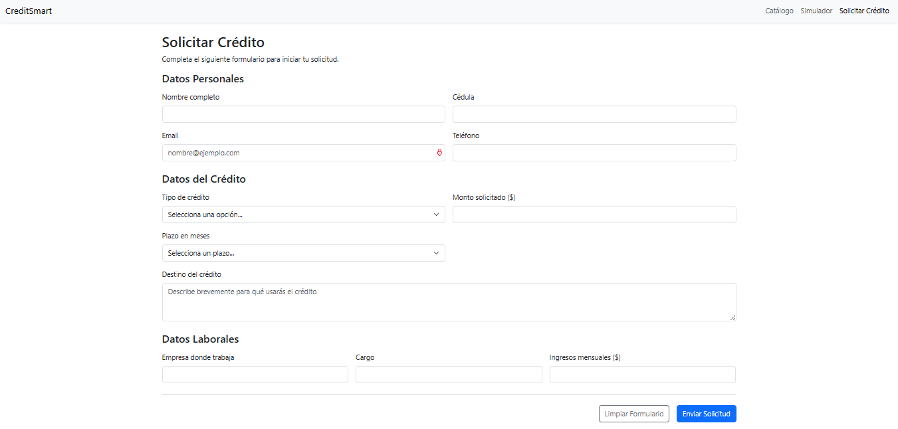

# 🚀 CreditSmart - Sistema de Gestión de Crédito

Este proyecto es la Actividad 1 del curso de **Ingeniería Web I**. El objetivo es aplicar conceptos de HTML5, CSS3 y diseño responsive (utilizando el framework Bootstrap 5) para construir las interfaces de usuario de una plataforma de créditos llamada CreditSmart.

## 👤 Autor

* **Nombre:** [Miguel Angel Gomez Velez]

---

## 📝 Descripción del Proyecto

CreditSmart es una plataforma web ficticia hecha por Miguelit0.dev que permite a los usuarios:
* Consultar un catálogo de productos crediticios (Ej: Vivienda, Vehículo).
* Simular y filtrar créditos por nombre o monto.
* Completar un formulario en línea para solicitar un crédito.

Este repositorio contiene las 3 páginas web estáticas requeridas por el caso de estudio.

---

## 📂 Estructura de Archivos

El proyecto está organizado de la siguiente manera:
/CreditSmart |-- index.html (Página principal - Catálogo de Créditos) |-- simulador.html (Página de búsqueda y simulador) |-- solicitar.html (Página de formulario de solicitud) |-- README.md (Este archivo)

---

## 🚀 Instrucciones de Ejecución

Como este es un proyecto web estático (solo frontend), no requiere un servidor.

1.  Clona este repositorio o descarga los archivos en una carpeta local.
2.  Navega a la carpeta del proyecto.
3.  **Abre el archivo `index.html` en tu navegador web preferido** (Google Chrome, Firefox, etc.).
4.  La navegación entre las páginas está enlazada desde el menú superior.

---

## 📸 Capturas de Pantalla

A continuación se muestran las vistas principales de la aplicación.

### 1. Página Principal (Catálogo)

### 2. Página Simulador

### 3. Página Solicitar Crédito
