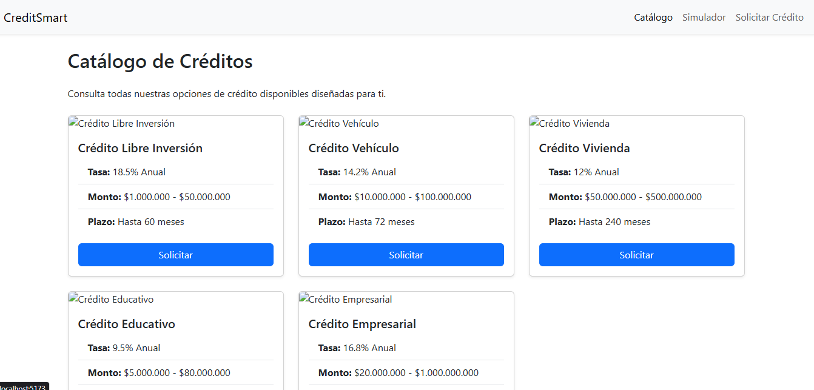
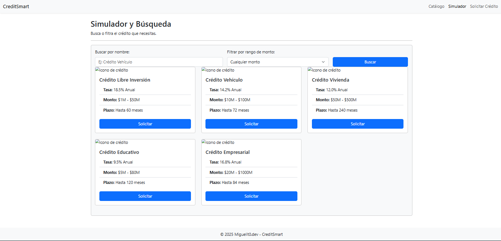
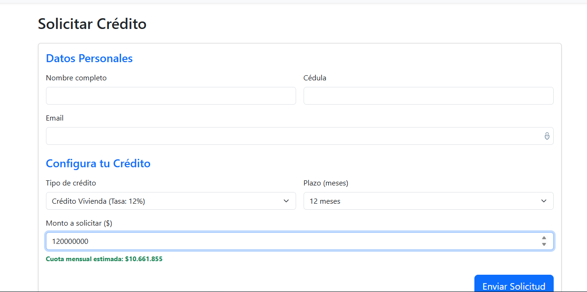

# ⚛️ CreditSmart - Aplicación Web con React

Este proyecto es la **Actividad 2** del curso de Ingeniería Web I. Es una evolución del sitio estático anterior, transformado ahora en una **Single Page Application (SPA)** dinámica utilizando **React** y **Vite**.

## 👤 Autor

* **Nombre:** Miguel Angel Gomez Velez

---

## 🚀 Características Nuevas

Esta versión incluye lógica de programación avanzada y gestión de estado:

* **Arquitectura basada en Componentes:** Uso de componentes reutilizables como `CreditCard` y `Navbar`.
* **Catálogo Dinámico:** Renderizado de productos desde un archivo de datos (`creditsData.js`) usando `.map()`.
* **Simulador Interactivo:** Búsqueda en tiempo real y filtrado de créditos por rangos de monto.
* **Solicitud Inteligente:** Formulario controlado que calcula automáticamente la **cuota mensual estimada** basándose en la tasa de interés del producto seleccionado.

---

## 🛠️ Tecnologías Utilizadas

* **React JS (v18):** Librería principal para la interfaz de usuario.
* **Vite:** Herramienta de construcción (Build tool) rápida y moderna.
* **React Router Dom:** Para la navegación sin recargar la página.
* **Bootstrap 5:** Para los estilos y el diseño responsive.
* **React Hooks:** Uso intensivo de `useState` (manejo de datos) y `useEffect` (cálculos automáticos).
---

## ⚙️ Instrucciones de Instalación

Para ejecutar este proyecto en tu máquina local, necesitas tener **Node.js** instalado.

1.  **Clonar el repositorio:**
    ```bash
    git clone https://github.com/Miguelit000/Credismart.git
    cd CreditSmart
    ```

2.  **Instalar dependencias:**
    ```bash
    npm install
    ```

3.  **Ejecutar el servidor de desarrollo:**
    ```bash
    npm run dev
    ```

4.  **Abrir en el navegador:**
    Generalmente en: `http://localhost:5173/`

---

## 📂 Estructura del Proyecto

/src |-- /components # Componentes reutilizables (Navbar, CreditCard) |-- /data # Fuente de datos simulada (creditsData.js) |-- /pages # Vistas principales (Home, Simulador, Solicitar) |-- App.jsx # Configuración de Rutas principal |-- main.jsx # Punto de entrada y estilos globales

## 📸 Capturas de Pantalla

### 1. Catálogo Dinámico


### 2. Simulador con Filtros


### 3. Cálculo de Cuota Automático
